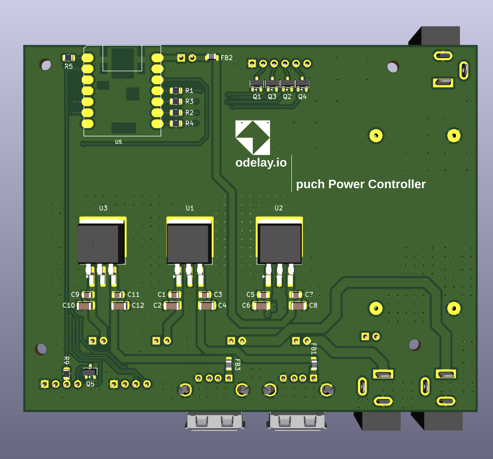

# puch-Power-Controller-Board

## Overview

KiCAD 9.0 board design for the puch Power Controller Board.  This boad has the following features:

- Create a custom PCB to remotely control the power input for KR260, PYNQ-Z1, and both Pluto SDRs
- Single 12VDC power supply will source power to all 4 devices
- Add clean external power to both Pluto SDRs (minimum ripple noise)
- Add PWM fan controlled by the ESP32 micro-controller to adjust fan speed
- Integration to Home Assistant via MQTT device
- Utilize already existing parts in my stock :)

### High-Level Block Diagram

### KiCAD Images

## KiCAD Design

The design was created using KiCAD 9.0.  The following provides a brief description of the files in the repository and the BOM.

| Document                                           | Description                                                  |
| -------------------------------------------------- | ------------------------------------------------------------ |
| puch-Power-Controller-Board_Gerber-Output.zip      | The Gerber files for fabrication of the PCB board.  This board was fabricated at [OSH Park](https://oshpark.com/). |
| puch-power-controller-SCH.pdf                      | PDF copy of the schematic                                    |
| *.kicad_pcb, *.kicad_prl, *.kicad_sch, *.kicad_pro | The KiCAD 9.0 design files                                   |
| /lib/odelay and /lib/xiao                          | KiCAD 9.0 Library for the components                         |

### Bill Of Materials

| Reference           | Qty  | Value                         | Mouser Part #        |
| ------------------- | ---- | ----------------------------- | -------------------- |
| C1,C5,C9            | 3    | 0.33uF                        | 963-EMK212B7334KG-T  |
| C2,C6,C10           | 3    | 22uF                          | 581-TAJA226K006R     |
| C3,C7,C11           | 3    | 0.1uF                         | 963-LMK212SD104KG-T  |
| C4,C8,C12           | 3    | 47uF                          | 581-TAJA476K006SNJV  |
| FB1,FB2,FB3         | 3    | FerriteBead                   | 81-BLM21SP181SN1D    |
| H1,H2,H3,H4         | 4    | MountingHole                  |                      |
| J1,J3,J4,J6,J14,J17 | 6    | Conn_01x02_Pin                |                      |
| J2,J7               | 2    | USB_A                         | 538-67643-0910       |
| J5,J12              | 2    | Conn_01x04_Pin                | 538-22-05-3041       |
| J10,J13,J16         | 3    | Barrel_Jack_Switch            | 640-DCJ250-10-A-K1-K |
| Q1,Q2,Q3,Q4,Q5      | 5    | PMBT2222A                     | 750-MMBT2222A-HF     |
| R1,R2,R3,R4,R5      | 5    | 1K                            |                      |
| R9                  | 1    | 0ohm                          |                      |
| U1,U2,U3            | 3    | LM7805_TO220                  | 595-LM7805SX/NOPB    |
| U4                  | 1    | LM2596_Module                 |                      |
| U5                  | 1    | MOUDLE-SEEEDUINO-XIAO-ESP32C3 |                      |
| U6                  | 1    | 4-Channel-Relay-Module        |                      |

## XIAO ESP32-C3 Firmware

The firmware is in the Home Assistant Devices repository: 

https://github.com/odelayIO/Home-Assistant-Devices/tree/main/HA_MQTT_puch_rack_controller
